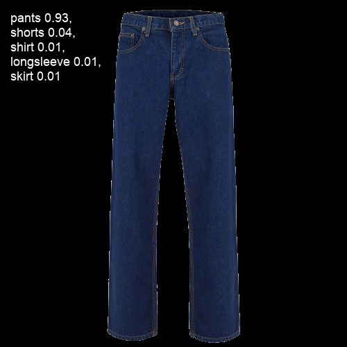

# Clothes clasification

## Data set of Roboflow

The data set used for this train is found in the following [link to Roboflow](https://universe.roboflow.com/fashion-g3m22/type-k4lkg)

### Dataset Split

|  Train set  | Valid set  |  Test set  |
| :---------: | :--------: | :--------: |
| 6037 images | 682 images | 742 images |
|     81%     |     9%     |    10%     |

### Preprocessing

- Auto-Orient: Applied
- Resize: Stretch to 640x640

### Download structure

Folder Structure

### Classes in this data set

- dress
- hat
- longsleeve
- outwear
- pants
- shirt
- shoes
- shorts
- skirt
- t-shirt

---

For this train I use the YOLOv8s-cls

| Model                                                                                        | size (pixels) | acc top1 | acc top5 | Speed CPU ONNX (ms) | Speed A100 TensorRT (ms) | params (M) | FLOPs (B) at 640 |
| :------------------------------------------------------------------------------------------- | :-----------: | :------: | :------: | :-----------------: | :----------------------: | :--------: | :--------------: |
| YOLOv8n-cls                                                                                  |      224      |   69.0   |   88.3   |        12.9         |           0.31           |    2.7     |       4.3        |
| [YOLOv8s-cls](https://github.com/ultralytics/assets/releases/download/v8.2.0/yolov8s-cls.pt) |      224      |   73.8   |   91.7   |        23.4         |           0.35           |    6.4     |       13.5       |
| YOLOv8m-cls                                                                                  |      224      |   76.8   |   93.5   |        85.4         |           0.62           |    17.0    |       42.7       |
| YOLOv8l-cls                                                                                  |      224      |   76.8   |   93.5   |        163.0        |           0.87           |    37.5    |       99.7       |
| YOLOv8x-cls                                                                                  |      224      |   79.0   |   94.6   |        232.0        |           1.01           |    57.4    |      154.8       |

## Demo

**Original image:**

**Image with predicts:**

## Colors processing

### Recognize predominant color function

The function `recognize_predominant_color` will open the PNG image, convert the pixels to RGBA, and then iterate over them, ignoring pixels that have an alpha (transparency) channel of 0. It will then count the frequency of each non-transparent color and return the predominant color.

> `The color predominant is: (30, 45, 78)`

**The color of the pants is also:**

### Matching Colors Function

This function `matching_colors` takes a selected color and a list of colors as input, along with a tolerance value. It then returns a list of colors from the input list that match well with the selected color within the specified tolerance range.

#### Usage:

- **`selected_color`**: The RGB color tuple that you want to find matches for.
- **`color_list`**: A list of RGB color tuples.
- **`tolerance`**: A numerical value representing the maximum allowable difference between the selected color and the colors in the list for them to be considered a match.
